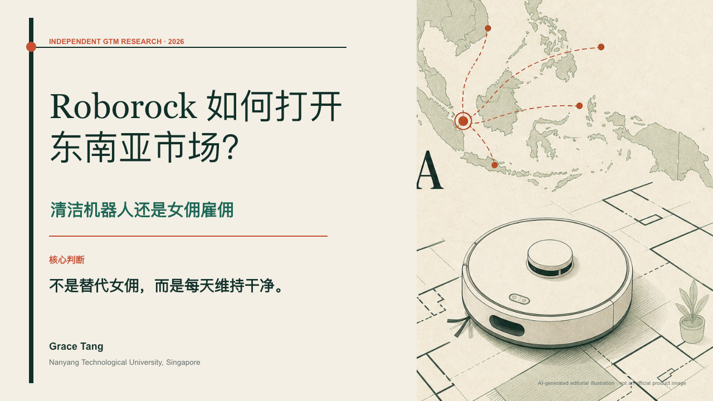
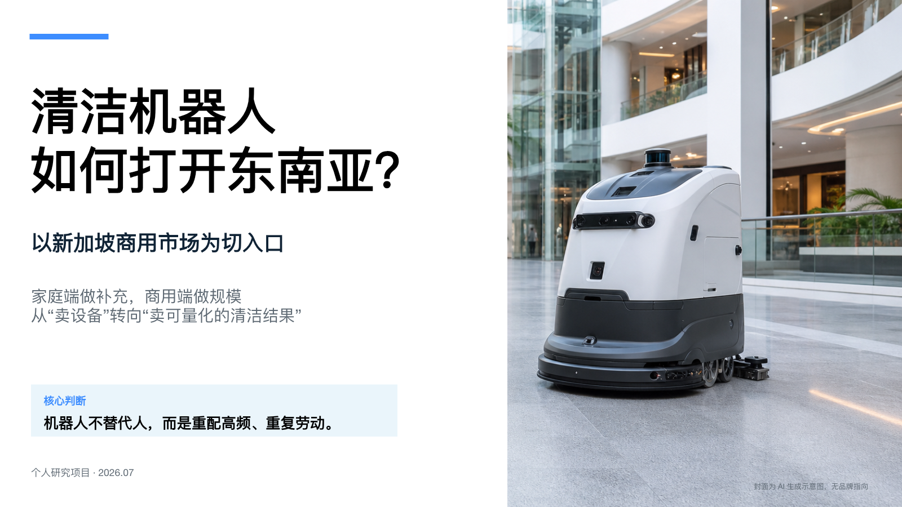

# Roborock 新加坡市场产品与渠道研究

> Personal Research Project · Singapore · 2026.02–2026.05
>
> 从产品参数、家庭清洁场景与渠道信任出发，研究 Roborock 如何在新加坡建立清晰的购买理由，并形成可向东南亚复制的 GTM 路径。

[在线阅读研究网页](https://gracetang0925.github.io/roborock-sea-gtm/) · [下载 Roborock GTM 报告](deliverables/Roborock东南亚市场进入研究_新加坡_GTM_2026.pptx) · [下载商用清洁机器人报告](deliverables/东南亚清洁机器人市场进入研究_新加坡_2026.pptx)



## 项目概览

| 项目 | 内容 |
| --- | --- |
| 项目名称 | Roborock 新加坡市场产品与渠道研究 |
| 项目性质 | 个人独立研究项目，非品牌委托 |
| 研究时间 | 2026.02–2026.05 |
| 核心市场 | 新加坡，并讨论向马来西亚、泰国、印尼与越南扩张的逻辑 |
| 个人角色 | 研究框架设计、资料采集、竞品分析、场景化卖点、渠道与售后研究、FAQ、GTM 建议、PPT 制作 |
| 研究对象 | Roborock 家用清洁产品、主要竞品与新加坡销售渠道；补充商用清洁机器人市场进入研究 |
| 公开交付 | 2 份研究 PPT、GitHub Pages 项目网页及本 README |

## 为什么研究这个问题

新加坡家庭同时存在高人工成本、双职工家庭比例高、公寓居住、宠物毛发、潮湿环境与较成熟的钟点保洁/住家帮佣体系。消费者面对清洁机器人时，真正的问题通常不是“吸力有多大”，而是：

- 机器人能否减少每天重复的地面维护？
- 不同房型、家具高度、门槛和杂物环境应该选择哪一档产品？
- 高端基站和避障能力是否值得额外付费？
- 官方渠道与灰色进口的价差，能否覆盖保修和售后的风险？
- 机器人与女佣、钟点保洁应该如何分工，而不是相互替代？

因此，本项目不把结论停留在参数罗列，而是尝试建立一条完整的产品运营链路：

**产品能力 → 使用场景 → 用户价值 → 渠道解释 → 购买决策 → 反馈指标**

## 研究范围与规模

本项目围绕扫地机器人、洗地机和无线吸尘器 3 类产品设计 SKU 研究框架，并按以下口径组织研究：

| 维度 | 项目口径 |
| --- | ---: |
| Roborock 产品 | 约 15 款 |
| 竞品品牌 | 4 个 |
| 代表性竞品机型 | 12 款 |
| 产品对比维度 | 18 项 |
| 新加坡销售渠道 | 约 6 个 |
| 价格、促销、保修与售后信息 | 约 35 组 |
| 场景化卖点 | 20 条 |
| 购买决策 FAQ | 15 条 |

公开版 PPT 以管理层可快速阅读的“研究摘要与 GTM 建议”为主，因此没有在每页展开全部 SKU 与价格底表；上述数量按照项目研究统计口径呈现。

## 研究框架

### 1. SKU 与竞品矩阵

围绕以下五组能力建立 18 项对比维度：

1. **清洁性能**：吸力、扫拖能力、毛发处理、边角覆盖与地面适配。
2. **基站维护**：集尘、洗拖布、烘干、补水、自清洁及日常维护工作量。
3. **导航避障**：建图方式、复杂障碍识别、低矮空间通过与多房间路线稳定性。
4. **智能控制**：App 地图、房间/区域任务、清洁策略与自动化设置。
5. **基础规格**：机身高度、续航、尺寸、耗材、保修与售后条件。

竞争研究不仅比较“谁的参数更高”，也比较同一功能在真实家庭中减少了多少人工介入。

### 2. 技术能力到使用场景

以 HyperForce、PreciSense LiDAR、ReactiveAI、StarSight 与 RockDock 等技术为研究对象，将型号差异转化为消费者能够理解的使用任务：

| 技术/能力 | 对应场景 | 需要回答的用户问题 |
| --- | --- | --- |
| HyperForce 吸力 | 宠物毛发、地毯与日常颗粒物 | 是否能减少重复清扫和残留？ |
| PreciSense LiDAR | 多房间、多楼层与稳定建图 | 第一次建图后能否稳定完成任务？ |
| ReactiveAI | 电线、玩具与复杂家庭障碍 | 是否需要频繁“救援”机器人？ |
| StarSight | 复杂障碍、低矮家具与精细导航 | 高端导航能力解决了什么具体麻烦？ |
| RockDock 基站 | 忙碌家庭与低维护需求 | 自动化是否真正减少倒尘、洗布和晾晒？ |

场景化输出重点覆盖宠物毛发、复杂障碍、低矮家具、多楼层、小户型与低维护 6 类需求。

### 3. 产品梯度与购买任务

研究将产品梯度简化为三种购买任务，而不是让消费者在大量型号中自行比较：

- **Q7：降低首次购买门槛。** 面向小户型、预算敏感或第一次尝试扫地机器人的用户。
- **Qrevo：减少日常维护。** 面向双职工、有宠物、希望获得较完整基站体验的家庭。
- **Saros：减少复杂环境中的人工救援。** 面向低矮家具、障碍较多及愿意为高端导航和服务付费的用户。

核心不是宣称“机器人替代人”，而是建立更可信的清洁分工：

> 机器人负责高频、重复的地面维护；人继续负责整理、照护、厨房、边角与周期性深度清洁。

### 4. 渠道、定价与售后

项目计划调研官网、官方商城与授权零售商等约 6 个渠道，采集价格、促销、保修和售后信息，重点分析：

- 官方渠道与灰色进口的价格差异；
- 同一型号在大促、套装和赠品机制下的实际成交差异；
- 保修范围、维修入口、耗材供应与换新机制；
- 高端产品是否在购买前、安装中和使用后都具备可见服务；
- 门店演示、创作者内容、官方电商和渠道导购各自承担什么角色。

研究判断：新加坡高端定价的前提不是单独强调参数，而是让本地服务在购买前就被看见。

### 5. 购买决策 FAQ

围绕消费者与销售人员最常遇到的问题整理 FAQ，例如：

- 扫地机器人能否替代女佣或钟点保洁？
- 哪一档产品适合小户型、宠物家庭或低矮家具？
- 高端避障和全能基站是否值得加价？
- 官方渠道为什么比灰色进口更贵？
- 保修、维修、耗材和 App 服务如何影响长期使用？
- 家中杂物较多、门槛较高或有多楼层时应该如何选择？

## 核心结论

### 结论一：不要用“替代女佣”打开市场

更可信的价值主张是：**让机器人负责每日清洁频次，让人继续处理复杂度。** 这能避免夸大产品能力，也更符合新加坡家庭已有的清洁分工。

### 结论二：高端产品需要“服务证明”

消费者购买的不只是硬件，还包括建图成功、使用教学、耗材、维修和长期可靠性。产品越高端，越需要把售后与服务设计成可见的购买理由。

### 结论三：渠道不只是卖货，也承担信任与教育

线下门店适合完成演示与户型问诊，官方商城承担价格和保修信任，创作者内容解释真实使用，授权零售商扩大覆盖。不同渠道需要统一 FAQ 与产品价值语言。

### 结论四：先用新加坡证明高端价值，再向区域扩张

新加坡适合验证高端产品、服务流程和案例表达；马来西亚与泰国可承接平台与渠道扩张；印尼与越南则更需要入门型号、本地内容和分期/促销机制。

## 建议的 90 天验证路径

| 阶段 | 核心动作 | 建议观察指标 |
| --- | --- | --- |
| 0–30 天 | 家庭问诊、门店/样板房演示、FAQ 共创 | 选型完成率、首次建图成功率、演示后意向、常见障碍 |
| 31–60 天 | 真实家庭试用、异议内容、渠道对比 | 任务完成率、人工救援原因、内容完读、退换货原因 |
| 61–90 天 | 案例沉淀、服务证明、耗材与售后触点 | 售后工单类型、耗材附加率、服务响应、推荐意愿 |

以上为建议方案与验证指标，不是已经发生的品牌销售或用户增长结果。

## 仓库中的两份报告

### A. Roborock 东南亚市场进入研究｜新加坡 GTM

[下载 PPT](deliverables/Roborock东南亚市场进入研究_新加坡_GTM_2026.pptx)

8 页执行摘要，重点包括：

- 新加坡家庭清洁需求与“机器人 + 人”的任务分工；
- Q7、Qrevo、Saros 三档购买任务；
- Roborock 与 Dreame、Ecovacs、Narwal 的价值差异；
- 高端定价所需要的本地服务与渠道信任；
- 一个双职工、公寓、宠物家庭的 90 天验证案例；
- 从新加坡向马来西亚、泰国、印尼与越南扩张的顺序。


### B. 东南亚商用清洁机器人市场进入研究

[下载 PPT](deliverables/东南亚清洁机器人市场进入研究_新加坡_2026.pptx)

9 页行业扫描，作为相邻场景补充，重点包括：

- 商场、酒店、园区与设施管理场景；
- 商用机器人与人工保洁的任务分工；
- 新加坡采购方、设施管理公司与渠道伙伴；
- 设备销售、租赁/订阅与清洁服务打包等商业模式；
- 六个代表性商用品牌的竞争维度；
- 面向销售的常见异议与 FAQ。



## 研究方法与工具

- **桌面研究**：品牌官网、官方商城、授权渠道与竞品公开资料。
- **渠道观察**：价格、促销、保修、售后、套装与销售话术。
- **用户信号**：公开论坛与 Reddit 讨论仅作为定性信号，不作为统计样本。
- **分析方法**：SKU 矩阵、场景—功能映射、购买决策链、FAQ、90 天验证方案。
- **输出工具**：PowerPoint、结构化研究表、GitHub Pages 与 AI 辅助整理。

## 证据边界

- 本项目为个人独立研究，非 Roborock 或其他品牌委托，也不代表品牌官方立场。
- 产品规格、价格与促销具有时间性，应以购买时的新加坡官方渠道信息为准。
- Reddit 与公开讨论用于发现问题和语言，不代表市场规模或总体用户比例。
- GTM、渠道、内容与 90 天验证均为策略建议，不是已经执行的商业结果。
- Roborock 及其他品牌名称与商标归其各自权利人所有。

## Repository Structure

```text
.
├── README.md
├── index.html                 # 项目首页 / GitHub Pages
├── report.html                # 在线报告与下载页
├── assets/
│   ├── roborock-gtm-cover.png
│   └── commercial-cleaning-cover.png
└── deliverables/
    ├── Roborock东南亚市场进入研究_新加坡_GTM_2026.pptx
    └── 东南亚清洁机器人市场进入研究_新加坡_2026.pptx
```

## Resume-ready Description

**Roborock 新加坡市场产品与渠道研究｜个人研究项目｜2026.02–2026.05**

- 围绕扫地机器人、洗地机和无线吸尘器 3 类产品设计 SKU 研究框架，覆盖约 15 款 Roborock 产品及 4 个竞品品牌的 12 款代表机型，按照清洁性能、基站维护、导航避障、智能控制及基础规格等 18 项维度开展对比。
- 以 HyperForce、PreciSense LiDAR、ReactiveAI、StarSight 及 RockDock 等技术为研究对象，将型号差异转化为宠物毛发、复杂障碍、低矮家具、多楼层、小户型及低维护等 6 类使用场景，形成场景化卖点表。
- 调研官网、官方商城及授权零售商等约 6 个渠道，采集约 35 组价格、促销、保修及售后信息，输出 20 条场景化卖点及 15 条购买决策 FAQ，覆盖价格差异、机型选择、户型适配、灰色进口与售后服务等问题。

## Author

**Grace Tang**<br>
Nanyang Technological University, Singapore<br>
[nie26.tx4120@e.ntu.edu.sg](mailto:nie26.tx4120@e.ntu.edu.sg)
